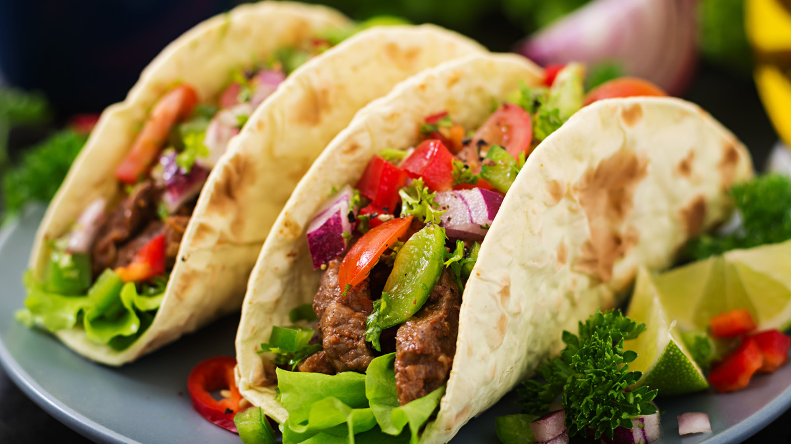

# Food_and_drinks

## INTRODUCTION
Food is more than just sustenance; it’s a vital part of culture and community. Different regions around the world have their own culinary traditions, each telling a story through flavors, ingredients, and cooking techniques. For example, Italian cuisine celebrates the richness of fresh tomatoes, basil, and olive oil, while Japanese cooking emphasizes simplicity and seasonal ingredients, showcasing the beauty of umami. These diverse practices not only nourish our bodies but also connect us to our heritage and the people we share meals with.

The preparation and enjoyment of food can also be a profound experience, often bringing people together in celebration. Family gatherings, holiday feasts, and casual get-togethers revolve around shared dishes that evoke nostalgia and warmth. Whether it’s the comforting aroma of a slow-cooked stew or the vibrant colors of a fresh salad, the act of cooking can be a creative outlet. Recipes passed down through generations become a way to honor our ancestors while adding our own personal touch, making each meal unique and special.

Moreover, the exploration of food extends beyond our immediate surroundings. Traveling to new places often means discovering local specialties and street food that offer a taste of everyday life for the locals. From the spicy tacos of Mexico to the delicate pastries of France, each bite can be an adventure, providing insight into the culture and traditions of a region. As we broaden our culinary horizons, we develop a deeper appreciation for the diversity of flavors and cooking methods, enriching our understanding of the world and fostering a sense of global community.

## DATA

The following table presents a variety of food items, their main ingredients, cooking methods, and popular cuisines. This overview highlights the diversity of culinary practices around the world.

| Food Item       | Main Ingredients       | Cooking Method      | Popular Cuisine    |
|------------------|-----------------------|---------------------|--------------------|
| Spaghetti Carbonara | Pasta, Eggs, Bacon    | Boiled, Pan-fried   | Italian            |
| Sushi            | Rice, Fish, Seaweed   | Rolling, Molding    | Japanese           |
| Tacos            | Tortillas, Meat, Veggies | Grilling, Assembling | Mexican            |

## IMAGES

 
# TEAM
Solomiia Vikovych 1,6

Viola Paderina 4,5

Polina Minkova 2,3

### Github names
SolomiiaVikovych
PolinaMinkova
ViolaPaderina

